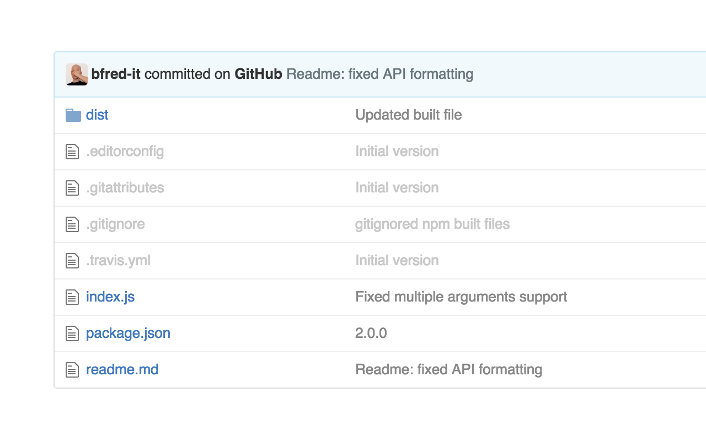

# Dim Files on GitHub

> Chrome extension - Dim dotfiles (or any file) in the GitHub file browser

In the options, you can choose between hiding or dimming files matching a custom regex. Forked from [sindresorhus/hide-files-on-github](https://github.com/sindresorhus/hide-files-on-github) to just dim files unobtrusively instead of hiding them completely.

## Install

Install it from the [Chrome Web Store](https://chrome.google.com/webstore/detail/hide-files-on-github/lpnakhpaodhdkleejaehlapdhbgjbddp) or [manually](http://superuser.com/a/247654/6877).

## License

MIT © [Sindre Sorhus](https://sindresorhus.com)

Forked from [sindresorhus/hide-files-on-github](https://github.com/sindresorhus/hide-files-on-github) by [Federico Brigante](https://twitter.com/bfred_it)

